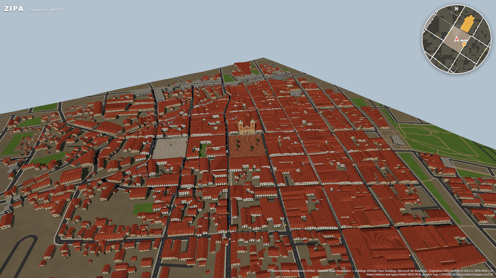
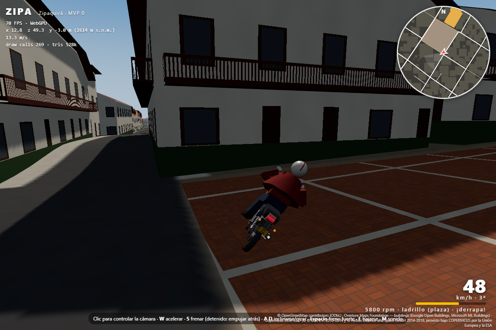
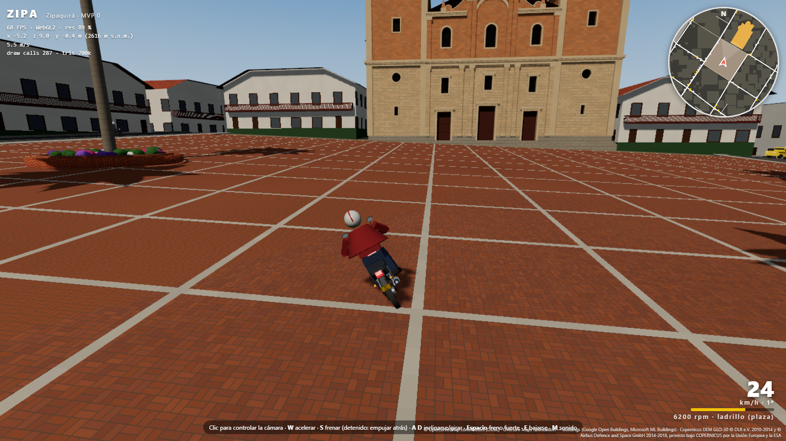

# ZIPA — Una ciudad. Tu historia.

Juego 3D en tercera persona ambientado en Zipaquirá (Cundinamarca, Colombia).
**MVP 0:** un personaje camina, corre y salta por las calles reales del centro histórico, sobre terreno y
edificios generados a partir de datos geográficos reales (OSM, Overture, Copernicus). Ver `SOURCES.md`
y `docs/INFORME.md`.



**Fase 2 — plaza y catedral:** ver [docs/INFORME_CATEDRAL.md](docs/INFORME_CATEDRAL.md).
**Parque de la Independencia:** ver [docs/INFORME_PARQUES.md](docs/INFORME_PARQUES.md).
**Vías, semáforos y tráfico:** ver [docs/INFORME_TRAFICO.md](docs/INFORME_TRAFICO.md).


## Requisitos

- Node.js ≥ 20 (probado con 22.17)
- Python ≥ 3.11 (probado con 3.13), sólo para regenerar el mundo
- Un navegador con WebGPU (Chrome/Edge recientes). Sin WebGPU, three.js usa WebGL2 automáticamente.

## Jugar

`public/world/` ya está generado, así que el pipeline no hace falta para jugar.

```bash
npm install
npm run dev
```

Abre `http://localhost:5173`. Para forzar WebGL2: `http://localhost:5173/?webgl`.

| Control | Acción |
|---|---|
| Clic en la vista | Captura el ratón (Esc lo suelta). También se puede arrastrar con el botón pulsado |
| Ratón | Orbitar la cámara |
| Rueda | Distancia de la cámara (1.6–14 m) |
| W A S D / flechas | Moverse (relativo a la cámara) |
| Shift | Correr |
| Espacio | Saltar |
| E (o F) | Subirse / bajarse de la moto (aparece un aviso cuando estás cerca) |

**En moto:** W acelerar · S frenar (detenido y sostenida: empujar hacia atrás, las motos no tienen reversa) ·
A/D inclinarse para girar · Espacio freno fuerte · E bajarse (a menos de 11 km/h) · M silenciar el sonido.
La moto está estacionada en la calle más cercana a la plaza (punto naranja en el minimapa). Es una 125 cc tipo
Honda CB125F: caja automática de 5 marchas, punta ≈ 95 km/h a la altitud de Zipaquirá. Agarra menos en adoquín
que en asfalto (la superficie sale de OSM). La cámara se pone sola detrás de la moto si no mueves el ratón.





El HUD muestra FPS, backend (WebGPU/WebGL2), posición y altitud. El minimapa (norte arriba) dibuja la red
vial real, la plaza, la catedral y el límite del área.

## Regenerar el mundo (pipeline offline)

```bash
cd pipeline
python -m venv .venv
.venv\Scripts\pip install -r requirements.txt     # en Linux/macOS: .venv/bin/pip
.venv\Scripts\python run_all.py                    # usa la caché de data/cache/ si existe
.venv\Scripts\python run_all.py --refresh          # vuelve a descargar todo
```

o, desde la raíz (Windows): `npm run pipeline`.

| Paso | Script | Salida |
|---|---|---|
| 1. OSM (Overpass, con reintentos y mirrors) | `fetch_osm.py` | `data/cache/osm_raw.json`, `osm_meta.json` |
| 2. Overture buildings (última release) | `fetch_overture.py` | `data/cache/overture_buildings.geojson` (+ `.state` con la release) |
| 3. DEM: `data/raw/*.tif` si existe (IGAC), si no Copernicus GLO-30 | `fetch_dem.py` | `data/cache/dem.tif`, `dem_meta.json` |
| 4. Mundo | `build_world.py` | `public/world/*` |

Si una descarga falla, el pipeline **se detiene con error**: nunca rellena con datos inventados.

### Qué genera `public/world/`

| Archivo | Contenido |
|---|---|
| `world.json` | Origen (lat/lon, UTM, factor de escala, cota), terreno, plaza, hitos, estadísticas, atribución |
| `terrain.bin` | Alturas Float32, rejilla de 461 × 461 cada 2 m (920 m de lado) |
| `ground.png` | Textura de suelo 4096²: calzadas por ancho de `highway=*`, aceras, plaza, zonas verdes |
| `buildings.glb` | Edificios extruidos, **un mesh por manzana**, una primitiva por material de arquetipo; cubiertas a dos aguas y balcones |
| `catedral.glb` | Catedral Diocesana modelada sobre su huella OSM (`pipeline/catedral.py`) |
| `buildings.json` | Por edificio: fuente, arquetipo y regla aplicada, altura, `est` (altura estimada) |
| `roads.json` | Red vial (polilíneas) para el minimapa y la lógica de juego |
| `roadgraph.json` | Grafo vial para el tráfico: tramos entre cruces con carriles, sentido y velocidad; semáforos (OSM y estimados); cebras |
| `roads.glb` | Andenes con sardinel y señalización horizontal (líneas, cebras, líneas de pare) |
| `corners.json` | Esquinas reales (nodo OSM, lat/lon original, x/z) para el test de escala |
| `props.json` | Árboles y postes de OSM (InstancedMesh) |

## Valores ajustables (`src/data/`)

No hay que tocar la lógica para cambiar estos valores. Tras editarlos, ejecuta el pipeline de nuevo.

- `roads.json`: ancho de calzada y de acera por clase `highway=*`, superficies, colores, estilo del minimapa.
- `buildings.json`: altura por piso y arquetipo, reglas de estimación de altura, reglas de arquetipo
  (radio del núcleo histórico, etiquetas, distancia a vías arteriales), altura del hito, colores.
- `player.json`: velocidades, salto, gravedad, cápsula, pendiente máxima, escalón, cámara.
- `vehicles.json`: moto (ficha técnica de referencia, curva de par, relaciones de caja, masas, CdA, frenos,
  inclinación, adherencia por superficie, cámara, sonido, colores, placa).
- `world.json`: tamaño del área, margen y paso del terreno, suavizado del DEM, cielo, niebla, sol, sombras,
  resolución dinámica (objetivo de FPS).
- `catedral.json`: dimensiones de la catedral (cuerpos, torres, vanos, cúpulas, cubiertas, colores), con su fuente.
- `plaza.json`: rasante de la plaza, adoquín, materas con banca circular, palmas.
- `trafico.json`: carriles, velocidades por clase, regla de semáforos estimados y tiempos del ciclo, señalización,
  andenes, número y mezcla de vehículos, parámetros IDM, burbuja de tráfico.
- `parques.json`: otros parques modelados (Parque de la Independencia): ids OSM de sus elementos, pavimento,
  plataforma y escalinata, estatua, banderas y fuente, con la fuente de cada dato.

## Coordenadas

1 unidad = 1 metro. UTM 18N (EPSG:32618) con origen local en el centroide de la plaza:
`x = (E − E0) / k`, `z = −(N − N0) / k`, `y = h − h0`. Aquí `k` = 0.999751 es el factor de escala UTM en el
origen, de modo que las distancias del juego son distancias reales sobre el terreno. +X = este, −Z = norte
(de cuadrícula; la convergencia con el norte verdadero es de 0.087°), Y = altura.

## Pruebas

```bash
npm test             # escala (±1 m vs. OSM), física de la moto (125 cc real) y simulación de tráfico
npm run playtest     # Chrome real vía Playwright (22 pruebas): FPS, caminar, colisiones, cámara, monumento, tráfico, moto
npm run capture      # capturas: plaza N/E/S/O, aérea, catedral, torres, plaza elevada → docs/captures/
npm run capture-moto # moto estacionada, detenida con el pie en el suelo y en curva → docs/captures/moto_*.png
node scripts/capture.mjs CATEDRAL   # sólo una vista (N, E, S, W, AERIAL, CATEDRAL, TORRES, PLAZA, INDEPENDENCIA, INDEPENDENCIA_AEREA, NARINO, TRAFICO, CALLE)
npm run capture-parque              # primeros planos del Parque de la Independencia (fuente, estatua)
npm run build        # comprobación de tipos + build de producción en dist/
```

`playtest` y `capture` usan el Chrome instalado (`ZIPA_BROWSER=msedge` para usar Edge, `HEADED=1` para ver la
ventana, `WEBGL=1` para probar el fallback WebGL2).

## Estructura

```
pipeline/          Python: descarga + generación (config.py, fetch_*.py, build_world.py, catedral.py, vias.py, run_all.py)
data/raw/          DEM local opcional (IGAC); no versionado
data/cache/        descargas crudas; no versionado
public/world/      mundo generado (lo carga el juego)
src/               juego (TypeScript, three.js WebGPU, Rapier)
  data/            valores ajustables (JSON)
  world/           terreno, edificios (fachadas TSL), catedral, plaza (materas instanciadas), parques, props, cielo
  player/          personaje (KinematicCharacterController) y avatar procedural
  traffic/         grafo de carriles, simulación (IDM, semáforos, reservas en cruces) y render instanciado
  vehicles/        moto: dinámica (motoDynamics.ts, probada con vitest), integración con Rapier, modelo, superficies
  audio/           sonido sintetizado del motor (WebAudio)
  camera.ts        cámara orbital con colisión (shape cast)
  ui/minimap.ts    minimapa
tests/             test de escala (vitest)
scripts/           Playwright: capturas y pruebas jugables
docs/              informes, capturas y fotos de referencia (docs/referencias/)
```
