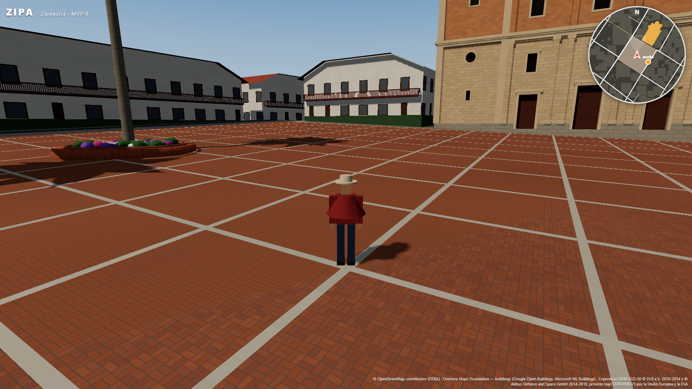
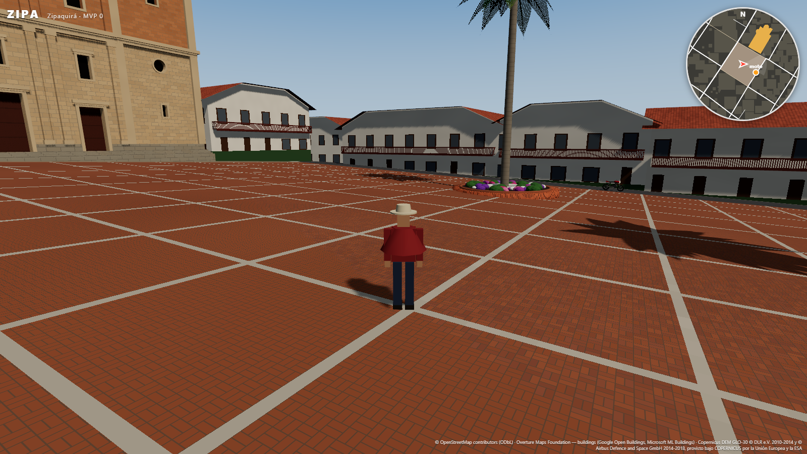
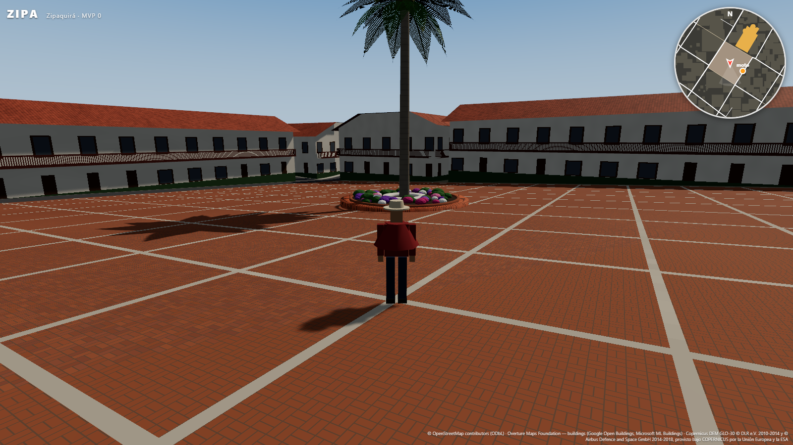
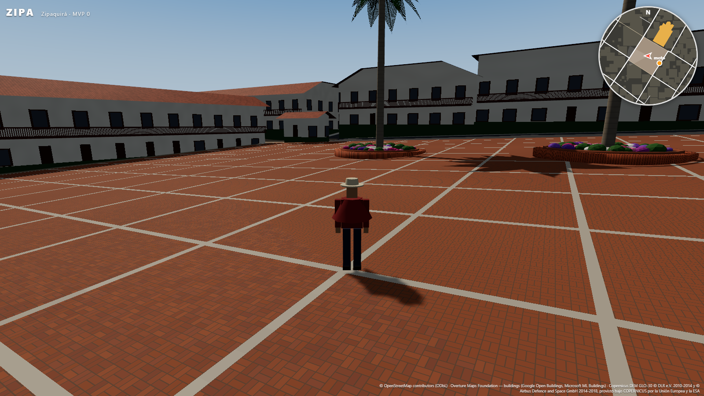

# Informe MVP 0 — ZIPA

> **Actualización (fase 2):** la catedral ya no es un volumen simple y la plaza tiene materas, palmas y adoquín; los edificios coloniales tienen cubierta a dos aguas. Ver [INFORME_CATEDRAL.md](INFORME_CATEDRAL.md). Las capturas de este informe se regeneraron con la fase 2.

**Estado:** cumplido. Un personaje camina, corre y salta por las calles reales del centro de Zipaquirá
(800 × 800 m alrededor de la Plaza de los Comuneros), sobre terreno real y entre 1 217 edificios extruidos
desde huellas reales. Corre a 120–160 FPS en una GPU integrada.

| Norte | Este |
|---|---|
|  |  |
| **Sur** | **Oeste** |
|  |  |

Vista aérea (SO → NE): [captures/vista_aerea.png](captures/vista_aerea.png).

## 1. Qué es dato real, qué es estimado y qué es procedural

### Dato real (sin modificar)
| Elemento | Fuente | Cantidad en el área |
|---|---|---|
| Trazado de calles (ejes) y clase `highway=*` | OSM | 210 tramos (100 residential, 48 service, 32 footway, 11 secondary, 7 tertiary, …) |
| Superficie de la vía cuando OSM la trae (`surface=sett`, `paving_stones`…) | OSM | 9 tramos |
| Ancho de calzada cuando OSM trae `width=*` | OSM | 1 tramo |
| Huellas de edificios | OSM | 945 |
| Huellas de edificios donde OSM no tiene | Overture (Google Open Buildings 235, Microsoft ML Buildings 37) | 272 |
| Pisos (`building:levels`) | OSM | 2 edificios |
| Plaza de los Comuneros (forma y centroide = origen) | OSM: cara de la red vial delimitada por 5 ways (ver SOURCES.md) | 6 839 m² |
| Huella de la Catedral Diocesana | OSM way 116943050 | 2 389 m² |
| Parques y zonas verdes | OSM `leisure`/`landuse` | — |
| Árboles | OSM `natural=tree` | 4 (3 en la plaza) |
| Relieve | Copernicus GLO-30 | −22 m … +42 m respecto a la plaza (2 615.6 m s.n.m.) |
| Manzanas | Derivadas de la red vial OSM (`polygonize`) | 72 |

### Estimado (regla documentada en `src/data/`, marcado en los datos)
| Elemento | Regla | Marca |
|---|---|---|
| **Altura de 1 214 de 1 217 edificios** (99.8 %) | Sin `height`/`levels` en OSM ni en Overture: pisos por arquetipo (colonial 2, casa 2, comercial 3, moderno 5; huellas < 30 m² → 1 piso) × altura de piso del arquetipo (colonial 3.6 m, casa 2.8 m, comercial 3.1 m, moderno 2.9 m) + remate de cubierta | `est: true`, `hsrc: "estimado:regla"` en `buildings.json` |
| Altura de la Catedral | 20 m, valor de catálogo de hitos (OSM no trae `height`). Volumen prismático simple, sin arquitectura inventada (sin torres ni cúpula) | `est: true`, `hsrc: "estimado:hito"` |
| Ancho de calzada (209 de 210 tramos) | Por clase `highway=*` (`src/data/roads.json`): secondary 9 m, tertiary 7.5 m, residential 6.5 m, footway 2.5 m… | `widthSource` en el pipeline |
| Aceras | OSM no tiene aceras mapeadas en el área (0 `sidewalk=*` útiles, 0 `footway=sidewalk`): ancho por clase (residential 1.4 m, tertiary 1.6 m, secondary 2 m) | — |
| Superficie de la vía sin `surface=*` | Asfalto por defecto para vías vehiculares; adoquín para peatonales | — |
| Arquetipo de cada edificio | Reglas en orden (`archetypeRules`), la primera que cumple: 1. Hito del catálogo → **hito** 2. ≥ 4 pisos conocidos, o `building=apartments/office/hospital/university/hotel…` → **moderno** (1) 3. `building=commercial/retail/industrial/warehouse/train_station…`, o tiene `shop`/`office` → **comercial** (10) 4. A ≤ 8 m de la calzada de una vía `primary`/`secondary` → **comercial** (34) 5. A ≤ 230 m de la plaza, ≤ 2 pisos y etiqueta residencial/cívica genérica → **colonial** (299) 6. Resto → **casa tradicional** (872) | `arch` + `rule` (texto de la regla aplicada) por edificio |
| Base del edificio | Paredes desde la cota mínima del terreno bajo la huella − 0.6 m (cimiento enterrado) hasta cota media + altura | — |

### Procedural (sólo visual, no pretende ser dato)
- Fachadas: ventanas, puertas, vitrinas, avisos y zócalos son patrones de shader (TSL) en coordenadas métricas,
  por arquetipo. La alternancia puerta/ventana y vitrina/cortina por vano usa un hash determinista.
- Variación de tono por edificio (±6 % colonial, ±12 % resto), derivada del id.
- Aleros de teja en colonial y casa tradicional: losa de 0.25 m con vuelo de 0.55/0.40 m. Las cubiertas son
  planas (no hay datos de forma de cubierta).
- Ruido de detalle sobre el suelo y en las fachadas; cielo degradado; avatar (maniquí con ruana y sombrero) y su
  animación.
- Si OSM trajera `natural=tree_row`, los árboles se repartirían cada 8 m sobre la línea real (hoy no hay ninguna en el área).

## 2. Verificación

| Prueba | Resultado |
|---|---|
| **Escala** (`npm test`): distancia entre esquinas en el juego vs. geodésica WGS84 (GeographicLib) desde las lat/lon originales de OSM | Calle 4×Cra 7 ↔ Calle 4×Cra 8: 83.570 m vs 83.570 m · Calle 1×Cra 6 ↔ Calle 7×Cra 9: 621.981 vs 621.981 m · Calle 2×Cra 4 ↔ Calle 5×Cra 12: 755.303 vs 755.304 m. **Error < 1 mm** (tolerancia ±1 m). Sin la corrección del factor de escala UTM el error sería de ~19 cm a 755 m |
| El test comprueba además | Que las esquinas son vértices de `roads.json` (la geometría que usa el juego), que sus lat/lon coinciden con el extracto OSM y que el origen es el centroide de la plaza (6/6 OK) |
| **Jugable** (`npm run playtest`, Chrome real) | Caminar 2.1 m/s · correr 5.7 m/s · salto +1.12 m y aterrizaje · el muro de la catedral detiene al jugador a 0.36 m · con la pared detrás, la cámara se acerca a 0.3 m y no la atraviesa · 0 errores de consola. **8/8 en WebGPU y 8/8 en WebGL2** |
| **Rendimiento** | AMD Ryzen 7 PRO 4750G con **GPU integrada** Radeon Vega, 1600×900: **~145 FPS en reposo y ~125 corriendo (WebGPU)**, ~110 FPS en WebGL2. 74 mallas de manzana (178 draw calls de edificios), 38.5 k triángulos de edificios + 423 k de terreno |
| Build de producción | `npm run build` OK (tipos + Vite) |

Técnicas de rendimiento: un mesh por manzana con una primitiva por material (frustum culling por manzana),
árboles y postes con `InstancedMesh`, una sola textura de suelo para todas las calles (cero geometría de calles
y sin z-fighting), sombras de una sola cascada que siguen al jugador, física de paso fijo (60 Hz) con render
interpolado.

## 3. Limitaciones conocidas (honestas)

- **Alturas:** casi todas estimadas. Es la mayor brecha entre "real" y "creíble". El skyline es uniforme (2 pisos).
- **Catedral:** volumen de 20 m sin torres. La altura real está por medir; se cambia en `src/data/buildings.json → landmarks`.
- **DEM de 30 m y DSM:** el relieve general es real, pero no hay detalle a escala de bordillo, y el DSM incluye algo
  de la masa construida (se suaviza). Con un DTM del IGAC en `data/raw/` mejoraría sin tocar código.
- **Calles como textura:** quedan pegadas al terreno por construcción, pero no tienen bordillos ni desnivel acera/calzada.
- **Plaza vacía:** OSM sólo trae 3 árboles en la plaza; no se añadieron jardines, fuente ni mobiliario que no estén en los datos.
- **Huellas Google/Microsoft:** son detecciones automáticas; algunas son tejados de patios o anexos.
- `VISION.md` no estaba en el repositorio al empezar la sesión, así que no pude leerla. El MVP sigue sólo el enunciado de la sesión.
- El bundle de producción pesa 5.3 MB (1.9 MB gzip), por el WASM de Rapier embebido y three/webgpu.

## 4. Siguiente paso recomendado

**Alturas reales y la catedral, antes de cualquier jugabilidad.** Lo que más falta para que el centro se reconozca
es el perfil vertical, no la mecánica:

1. **Levantamiento de pisos de la zona de la plaza** (≈ 300 edificios del núcleo), con trabajo de campo o fotos
   propias, subido a OSM como `building:levels`. Beneficia también al mapa abierto, y el pipeline ya lo usa sin cambios.
2. **Catedral como `building:part`** (nave, torres, cúpula) con alturas medidas: el pipeline puede extruir partes
   igual que edificios, y se mantiene la regla de no inventar.
3. **DTM del IGAC** (o LiDAR municipal si existe) en `data/raw/` para tener bordillos y la pendiente real de las calles.
4. Después: calles como geometría con bordillos (malla por manzana a partir de `roads.json`) y streaming por
   tiles para crecer más allá de 800 m.

## Anexo — Moto (fase 3)

En el MVP 0 los vehículos estaban fuera de alcance; esta fase añade una moto que se puede conducir.

| Aspecto | Qué es |
|---|---|
| Dónde está estacionada | **Derivado de datos:** el punto de la calzada vehicular OSM (`roads.json`) más cercano al inicio, junto al borde derecho y orientada según la vía (a 39 m del centro de la plaza) |
| Física | **Arcade:** `KinematicCharacterController` de Rapier con una cápsula acostada (1.9 m × 0.84 m). Sube bordillos de hasta 22 cm y pendientes de hasta 35°. Giro según el modelo de bicicleta (distancia entre ejes 1.32 m); el ángulo de dirección se limita para no superar 0.8 g de aceleración lateral, así que el radio de giro crece con la velocidad. Al chocar pierde velocidad |
| Inclinación y cabeceo | **Calculados:** inclinación = atan(a_lateral / g), hasta unos 40°; cabeceo con rayos al suelo bajo cada rueda; apoyada en la pata cuando está estacionada |
| Modelo | **Procedural** low-poly, tipo moto de calle de 125 cc: rin de 5 radios, horquilla con lanzamiento de 24° que gira sobre su eje, tanque, exosto y placa amarilla de moto colombiana |
| Valores | `src/data/vehicles.json` |

Además, el adoquín de la plaza ahora se recorta en el borde de las calzadas vehiculares (la cara OSM de la plaza
llega hasta el eje de las calles): Carreras 7 y 8 muestran su propia superficie y la moto circula por ellas.

Verificación (`npm run playtest`, 16/16 en WebGPU y en WebGL2):
- Subirse con E.
- 0→54 km/h en 3 s.
- Giro a la derecha con 39° de inclinación.
- Frenar hasta 0.
- Chocar contra la catedral a toda velocidad sin atravesarla.
- Bajarse a 1.1 m de la moto, en un lugar libre (la posición se comprueba con una consulta de intersección).

Todo a 107–118 FPS.
