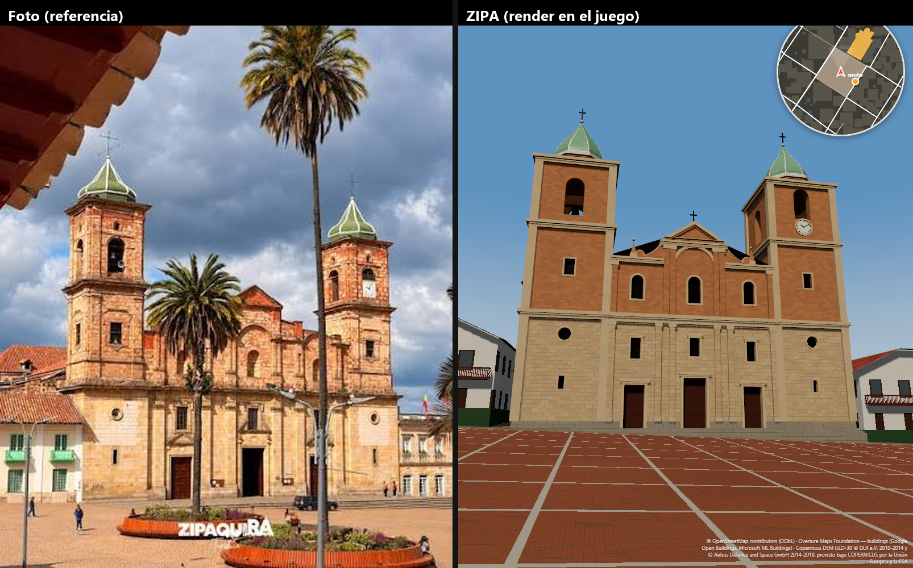
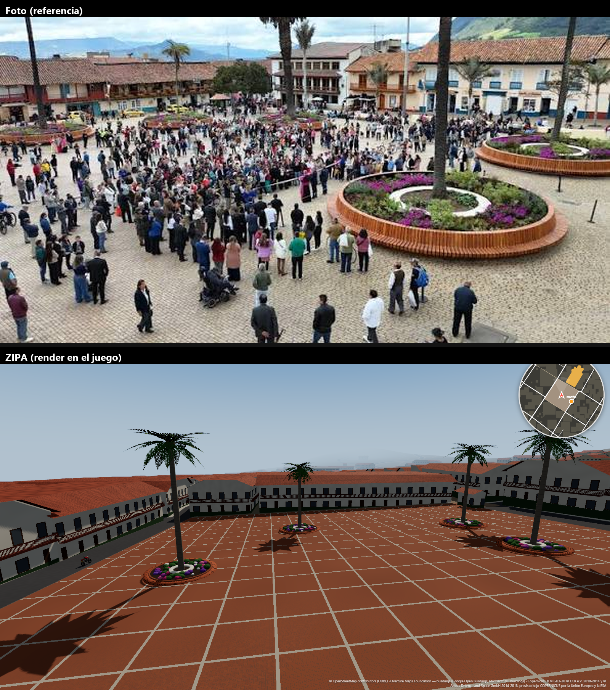

# Informe — Plaza de los Comuneros y Catedral (fase 2)

Objetivo: que el parque principal y la catedral se vean lo más reales posible, a partir de las fotos aportadas por
el usuario (`docs/referencias/`), sin inventar datos geográficos y documentando qué es medido, qué es estimado y
qué es procedural.

Otras vistas: [torres](captures/torres.png) · [plaza N](captures/plaza_N_norte.png) · [E](captures/plaza_E_este.png) ·
[S](captures/plaza_S_sur.png) · [O](captures/plaza_W_oeste.png) · [aérea](captures/vista_aerea.png).

## 1. Catedral Diocesana de Zipaquirá

Generada por `pipeline/catedral.py` → `public/world/catedral.glb` (8.3 k triángulos, 13 materiales).
Todos los parámetros están en `src/data/catedral.json`.

| Aspecto | Fuente | Certeza |
|---|---|---|
| Huella en planta (2 389 m²), fachada de 36.2 m, ábside, brazo absidal del crucero, sacristías | OSM way 116943050 | **dato** (el cuerpo de naves se regulariza a rectángulo: < 1.1 m de desviación) |
| Orientación: la fachada mira al SSO; torre poniente = campanario, torre oriente = reloj | OSM + Wikipedia (*Western Bell Tower*, *Oriental Tower Clock*) + foto | **dato** |
| Composición: tramo central de dos cuerpos con frontón triangular sobre 4 pilastras con retropilastras, cartones avolutados con pirámides herrerianas; dos torres de tres cuerpos; tres naves de igual altura (tipo salón), sin cúpula exterior, cubierta a dos faldones, brazos del crucero absidales, ábside, dos sacristías | C. Arbeláez Camacho, *Una obra poco conocida del arquitecto Fray Domingo de Petrés: la catedral de Zipaquirá*, Revista Apuntes, Pontificia Universidad Javeriana | **documental** |
| Alturas: 1.ᵉʳ cuerpo 11.8 m, torres 21.8 / 29.8 m, frontón 23.1 m, cúpulas hasta ~37.5 m (cruz incluida), alero de naves 15.3 m | Foto del usuario, escalada con el ancho OSM de la fachada y corregida por perspectiva | **estimado** (±10–15 %) |
| Vanos: 3 puertas rectangulares con ventana encima, óculos y aspilleras en las torres, ventanas en arco del 2.º cuerpo, arco en relieve, campanario con arcos en las 4 caras, reloj bajo el arco de la cara frontal de la torre oriental | Foto del usuario | **estimado** (posición y tamaño) |
| Colores y materiales: primer cuerpo en arenisca beige, cuerpos altos en sillar anaranjado, cúpulas vidriadas verdes con nervios blancos, puertas de madera rojiza | Foto del usuario; el estudio menciona "cantería mezclada con ladrillo" | **estimado** |
| Textura de sillares, tejas, vetas de la madera, manchas de intemperie | Shaders TSL | **procedural** |
| Gradas del atrio (4 × 17 cm) | Foto (se ven gradas en todo el frente) | **estimado** |
| Campanas, viga, hora del reloj (10:10) | — | **procedural / decorativo** |

El collider es la malla completa (trimesh): las gradas se suben solas (autostep de 35 cm) y la cámara choca con
torres y cornisas.

**Diferencias conocidas con la realidad**
- Las cúpulas son de 8 gajos con tambor octogonal; el perfil exacto es aproximado.
- Las molduras son cajas escalonadas: no hay capiteles corintios tallados.
- Las fachadas laterales y la cabecera no se ven en las fotos. Se modelaron con contrafuertes cada 5.6 m (el
  estudio da la proporción de los tramos) y ventanas altas; su detalle es **inferido**.
- OSM sólo dibuja el brazo absidal del crucero del lado poniente; no se añadió el del lado oriente.

## 2. Plaza de los Comuneros

| Elemento | Fuente | Certeza |
|---|---|---|
| Forma de la plaza | OSM (cara de la red vial, ver SOURCES.md) | **dato** |
| Rasante | Plano ajustado por mínimos cuadrados al DEM en el borde de la plaza (pendiente 3.4°, residuo ±0.42 m). Sustituye el DSM dentro de la plaza y la catedral, con transición de 14 m | **dato ajustado** (quita el relieve de los edificios vecinos que mete el DSM) |
| Materas con banca circular de listones, flores y palma | Una por cada árbol OSM (`natural=tree`) dentro de la plaza (4) | **posición: dato OSM; diseño: estimado de las fotos** |
| Dimensiones de las materas (Ø 8 m, asiento a 46 cm, muro a 58 cm, anillo blanco) | Fotos (escala por personas) | **estimado** |
| Adoquín de arcilla en petatillo con fajas de piedra cada 4.5 m | Foto de la plaza | **estimado / procedural** |
| Palmas (tronco de 9–15 m, 26 hojas) | Fotos | **estimado / procedural** |

Todo el mobiliario usa `InstancedMesh`: bancas, muros, tierra, anillos, troncos, coronas, 104 hojas de palma y
280 matas de flores.

**Pendiente de confirmar con el usuario:** las fotos muestran una matera con palma justo frente a la fachada
(con las letras ZIPAQUIRÁ), y OSM no la tiene. Parece que la remodelación cambió la plaza y OSM aún no lo refleja.
No se añadieron materas, letreros ni faroles que no estén en los datos. Basta con agregar las posiciones (o mapear
los árboles en OSM) para que el pipeline los genere.

## 3. Marco de la plaza (edificios vecinos)

- **Cubiertas a dos aguas** de teja de barro con alero (colonial 0.9 m, casa tradicional 0.6 m) en 1 125 edificios,
  en lugar de la losa plana anterior. La cumbrera sigue el eje largo del rectángulo mínimo de la huella; en crujías
  anchas la pendiente se limita a 5 m (franja superior plana). Los muros suben hasta la cubierta (hastiales) y el
  shader no pinta ventanas en el hastial. **Procedural**: la forma de la cubierta no está en los datos.
- **Balcones corridos de madera** en el segundo piso de 17 fachadas coloniales que miran a la plaza (a ≤ 18 m de su
  borde, aristas ≥ 5 m), como en la foto. **Procedural con regla documentada** (`src/data/buildings.json → balconies`).

## 4. Verificación

| Prueba | Resultado |
|---|---|
| `npm test` (escala, 6 pruebas) | OK: < 1 mm de error en 3 pares de esquinas |
| `npm run playtest` (9 pruebas en Chrome real) | 9/9 OK, incluida la nueva: **colisión con matera/banca** (el jugador queda a 4.33 m del centro de una matera de 4.0 m de radio) |
| Rendimiento con la plaza completa | 108–175 FPS (WebGPU, GPU integrada Radeon Vega, 1600×900) |

## 5. Siguientes pasos para la plaza

1. **Posiciones reales de las materas, faroles y letrero** tras la remodelación: con un plano o con mapeo en OSM
   (`natural=tree`, `highway=street_lamp`, `leisure=picnic_table`/`amenity=bench`).
2. **Medición de la catedral** (altura de torres y cornisas): con una cinta láser o con fotogrametría de fotos
   propias, el modelo se ajusta cambiando `src/data/catedral.json`.
3. **Edificios del marco de la plaza uno por uno** (Palacio Municipal, Concejo, casas con portales): son pocos y
   merecen un modelo propio como la catedral.
4. **Interior de la catedral** (tres naves de igual altura y bóvedas de crucería, según el estudio) cuando haya
   misiones que lo necesiten.
