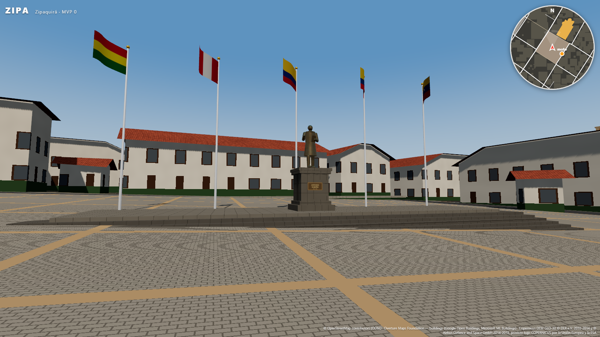
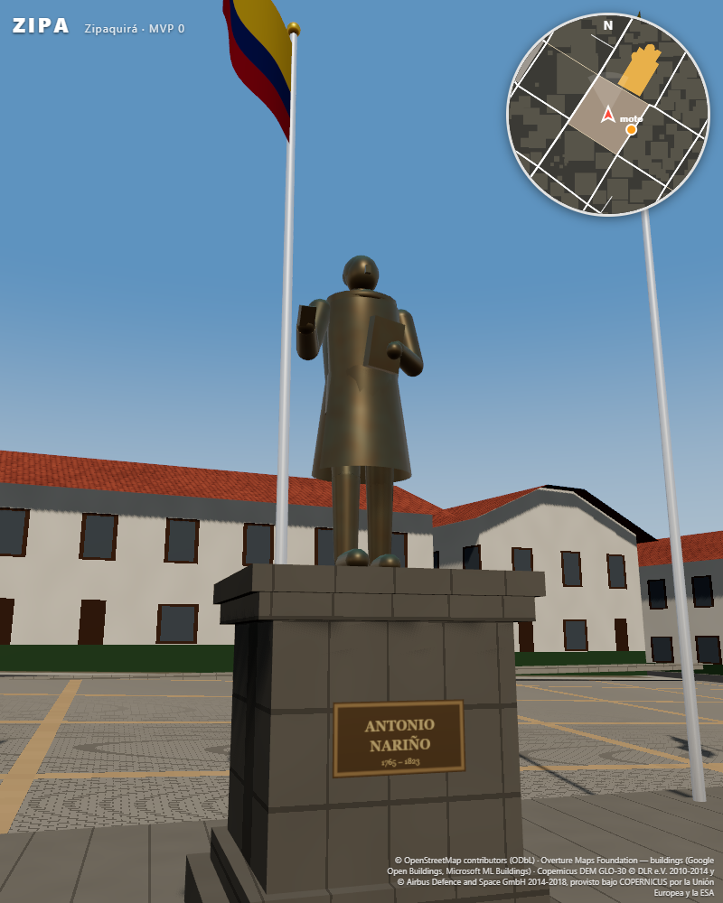
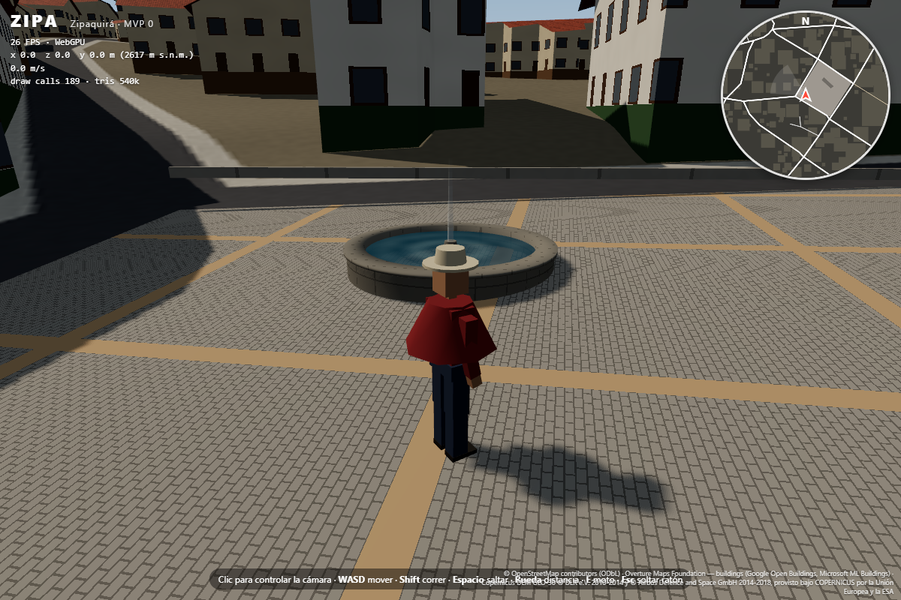
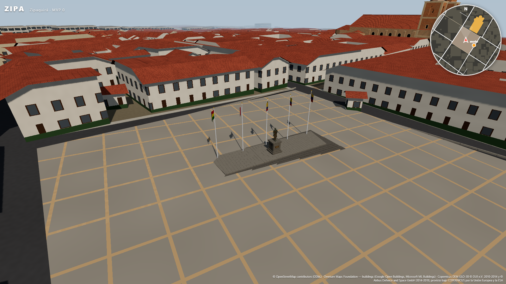

# Informe — Parque (Plaza) de la Independencia

| Estatua | Fuente | Vista aérea |
|---|---|---|
|  |  |  |

## Qué se sabe y de dónde sale

| Elemento | Fuente | Certeza |
|---|---|---|
| Forma del parque: rectángulo de 71 × 67 m (4 775 m²) alineado con la retícula | OSM way [321152342](https://www.openstreetmap.org/way/321152342) (`leisure=park`, "Plaza de la Independencia") | **dato** |
| Plataforma "Homenaje a la Independencia" de 22,6 × 5,9 m | OSM way [641689226](https://www.openstreetmap.org/way/641689226) (`area=yes`) | **dato** (huella) |
| Monumento "Banderas de Suramérica", sobre esa plataforma | OSM node [6042679831](https://www.openstreetmap.org/node/6042679831) (`historic=memorial`) | **dato** (posición) |
| "Fuente" de unos 4 m de diámetro, en la esquina noroeste | OSM way [641689499](https://www.openstreetmap.org/way/641689499) (`natural=water`) | **dato** (huella) |
| Inaugurada en 2010 donde estaba la antigua plaza de mercado. En el centro, estatua de **Antonio Nariño con un libro** (los Derechos del Hombre), con una cápsula del tiempo debajo. Las banderas aluden a los **países liberados por Bolívar** | Fichas de recorridos turísticos (Expedia, Travelocity, Trip.com). No son fuentes oficiales y comparten texto | **documental, no oficial** |
| Rasante | Plano ajustado al DEM en el borde del parque: pendiente de 2,5°, residuo ±0,31 m | **dato ajustado** |

No hay fotos con licencia libre del parque (Wikimedia Commons no tiene ninguna), y OSM no trae árboles, bancas ni
luminarias dentro del parque. Por eso **no se añadieron** árboles, bancas, faroles ni letreros.

## Qué es estimado (valores en `src/data/parques.json`)

- **Suelo:** adoquín de concreto gris con fajas, habitual en plazas renovadas hacia 2010. Es lo más visible del parque
  y no está confirmado; si es césped u otro material, basta con cambiar `paving`.
- **Plataforma:** nivelada sobre la huella OSM, a 42 cm de la cota media. Como la plaza tiene pendiente, se rodea de
  una escalinata con contrahuellas de 15 cm, tantas gradas como pide el lado bajo.
- **Estatua de Nariño:** de pie sobre un pedestal de piedra de 2,2 m. Figura de bronce de 2,4 m con levita, chaleco,
  corbatín y coleta, el libro contra el pecho y un gesto de orador. Mira al centro del parque. El diseño es genérico de
  estatuaria del siglo XIX, sin foto de la real. La placa de bronce dice "ANTONIO NARIÑO 1765 – 1823".
- **Banderas:** las cinco naciones bolivarianas (Venezuela, Ecuador, Colombia en el centro, Perú y Bolivia), en
  mástiles de 9 m en fila al fondo de la plataforma. Ondean con un *vertex shader* y el viento sopla desde el ENE.
  OSM las llama "Banderas de Suramérica": si en realidad son las de toda Suramérica, se cambia la lista `countries`.
- **Fuente:** pila de piedra circular con el radio de la huella OSM, agua animada y un surtidor central.

## Corrección de datos: falsos positivos de Overture

Google Open Buildings (vía Overture) tenía **4 "edificios" dentro del parque**, uno de 950 m² justo en el centro. Son
detecciones automáticas en un espacio que OSM mapea como abierto. Nueva regla, en
`src/data/buildings.json → geometry.overtureExcludeOpenSpaces`: se descartan los edificios Overture no-OSM cuyo
centroide cae dentro de un espacio abierto mapeado en OSM (parques, jardines, plazas, áreas peatonales y la plaza
principal). Se descartaron 35 detecciones en la caja de descarga, 22 de ellas dentro del área jugable (272 → 250
edificios Overture). Un edificio real dentro de un parque estaría en OSM y se conserva.

## Verificación

| Prueba | Resultado |
|---|---|
| `npm run playtest` | **19/19** en WebGPU y WebGL2. Nuevas: **subir la escalinata del monumento** (+0,80 m) y **chocar con el pedestal** (el jugador se detiene a 1,57 m del centro) |
| `npm test` | 13/13 |
| Rendimiento | 107 FPS en la vista inicial; 130–170 FPS en las vistas del parque (WebGPU, GPU integrada) |

## Para dejarlo idéntico al real

Con **2 a 4 fotos del parque** (una general, la estatua, las banderas y la fuente), igual que con la plaza
principal, se pueden confirmar el suelo, la vegetación, el mobiliario, el diseño del pedestal y la fuente, y el número
y orden de las banderas.
