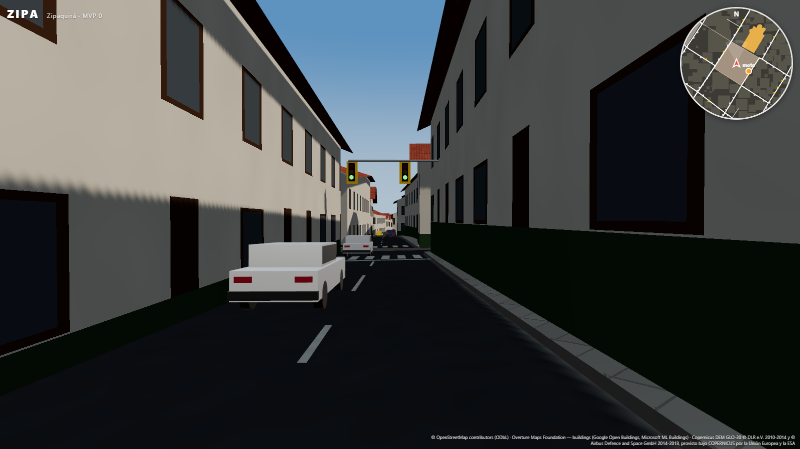
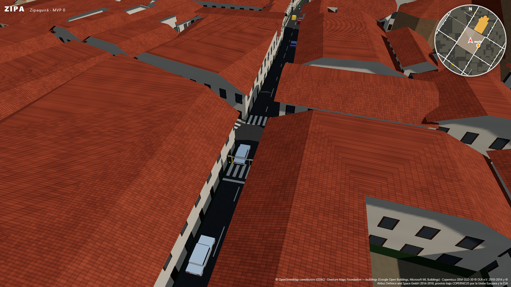

# Informe — Vías, semáforos y tráfico

## 1. Vías

| Elemento | Fuente | Certeza |
|---|---|---|
| Trazado, clase, sentido único (`oneway`) | OSM: 233 vías vehiculares, 72 de sentido único | **dato** |
| Número de carriles | `lanes=*` de OSM (4 vías). En las demás: doble sentido = 1 + 1; sentido único = 2 si la calzada mide ≥ 6 m, si no 1 | **dato / estimado** (`lanesSource` en `roadgraph.json`) |
| Velocidad | `maxspeed` de OSM (7 vías). En las demás, por clase: secundaria 40, terciaria 30, residencial 25 km/h | **dato / estimado** (`speedSource`) |
| **Andenes 3D con sardinel** de 15 cm | Ancho por clase de vía. Se recortan contra la calzada y las fachadas; no van sobre la plaza ni los parques. Tableta de concreto de 0,6 m con juntas | **estimado** (OSM no tiene andenes en el área) |
| **Señalización horizontal** (norma colombiana) | Línea central **amarilla** en doble sentido (continua cerca de los cruces, segmentada 3/4 m entre ellos); línea **blanca** segmentada entre carriles del mismo sentido; **cebras** y **líneas de pare** en los cruces semaforizados y en el paso peatonal de OSM. No se pinta sobre adoquín | **procedural con regla** |

En total: 226 tramos y 167 nodos en el grafo, 85 cruces, 257 andenes, 228 líneas y 16 cebras.

## 2. Semáforos

- **De OSM (dato):** los 4 nodos `highway=traffic_signals` del área, en la vía arterial del sureste, se asignan a sus
  cruces: 3 cruces, que comparten ciclo porque son un cruce doble.
- **Estimados (marcados `source: "estimado"` en `roadgraph.json`):** cruces de 4 o más accesos donde una vía
  principal (primary, secondary o tertiary) se cruza con otra calle, sin adoquín, por orden de importancia y a 120 m o
  más de cualquier otro semáforo. Hay 5:
  - Avenida Calle 8 × Carrera 7
  - Avenida Calle 8 × Carrera 5
  - Calle 2 × Carrera 7
  - Calle 1 × Carrera 8
  - Calle 6 × Carrera 7 (el más cercano a la plaza)
- **Funcionamiento:** dos fases (los accesos opuestos juntos) con verde de 20 s, amarillo de 3 s y todo rojo de 2 s.
  Cada cruce tiene su propio desfase.
- **Modelo:** semáforo colombiano de poste y brazo, con caja negra de tres luces y tablero de contraste amarillo.
  Las luces se ven encendidas o apagadas según el estado. En el minimapa aparecen como puntos de color.
- Los tiempos, el espaciado y las clases se ajustan en `src/data/trafico.json → signals`. Si sabes dónde hay
  semáforos reales, se pueden mapear en OSM (`highway=traffic_signals`) y el pipeline los usa como dato.

## 3. Vehículos

- **Mezcla (estimada, ciudad intermedia colombiana):** 32 % carros, 20 % taxis amarillos, 28 % motos, 10 % busetas
  blancas con franja verde y 10 % camionetas. Son unos 110 vehículos dentro de una burbuja de 210 m alrededor del
  jugador. Los que se alejan más de 250 m reaparecen entre 60 y 210 m, fuera de la vista inmediata.
- **Circulación:**
  - Tránsito por la derecha, respetando el sentido único de OSM.
  - Se sigue al vehículo de adelante con el modelo **IDM** (Treiber et al.): distancia de seguridad, aceleración y
    frenado suaves.
  - Giros con conectores curvos dentro del cruce, eligiendo el carril correcto: giro a la derecha desde el carril
    derecho, a la izquierda desde el izquierdo.
- **Cruces:**
  - Con semáforo: se detienen en rojo y en amarillo si pueden frenar a tiempo.
  - En todos: un vehículo sólo entra si ninguna trayectoria en conflicto (que se cruza o confluye) está ocupada y si
    hay espacio a la salida, así nadie bloquea el cruce. La reserva se libera cuando su cola sale del cruce.
- **Con el jugador:** frenan ante el peatón y ante la moto, y **pitan** si les cierras el paso más de 1,6 s. Cada
  vehículo tiene un cuerpo cinemático en Rapier: la moto choca con ellos y la cámara no los atraviesa.
- **Render:** un `InstancedMesh` por tipo de vehículo (10 draw calls para los 110). El color por instancia sale de
  una paleta realista y la pose se interpola entre pasos de simulación, con cabeceo según la pendiente.

## 4. Verificación

| Prueba | Resultado |
|---|---|
| `npm test` → `tests/traffic.test.ts` (simulación pura, reproducible) | 5/5: los carriles respetan los sentidos de OSM y la derecha; 2 minutos con 110 vehículos y ninguno a menos de 2,4 m en el mismo carril (92 % del tiempo en movimiento, sin trancones); **0 superposiciones** en 3 minutos, cruces incluidos; **0 vehículos cruzando en rojo** (22.534 muestras de vehículos detenidos en rojo); frena ante el jugador y pita |
| `npm run playtest` (Chrome) | **22/22 en WebGPU y en WebGL2**. Nuevas: tráfico circulando (106 vehículos a 17 km/h de media); los vehículos frenan ante el peatón (distancia mínima 1,8 m, nunca lo atropellan); la moto no atraviesa los vehículos |
| Rendimiento | Con todo el tráfico, corriendo por la ciudad: **75–79 FPS en WebGPU** a resolución completa y **69–75 FPS en WebGL2** con resolución dinámica al 79 %. La simulación corre a 30 Hz con interpolación y cuesta unos 0,8 ms de CPU por frame. Los shaders se compilan en la pantalla de carga, sin tirones al aparecer vehículos. Medido con la máquina cargada: con la escena vacía daba 84 FPS |

## 5. Limitaciones y siguientes pasos

- **Peatones:** aún no hay. Los andenes ya están listos para ellos.
- **Carriles:** sin cambios de carril ni adelantamientos; las motos no pasan entre carros, como sí pasa en Colombia.
- **Paraderos:** los de OSM existen (`highway=bus_stop`, 2 en el área), pero las busetas todavía no se detienen en
  ellos.
- **Modelos:** los vehículos son low-poly; con modelos `.glb` CC-BY se podrían reemplazar sin tocar la simulación.
- **Semáforos estimados:** confirmar o corregir con conocimiento local.

## 6. Rendimiento: cambios de esta fase

- **Shaders precompilados** (`renderer.compileAsync`) durante la carga. Antes, la primera aparición de los materiales
  nuevos (vehículos, semáforos) congelaba el juego varios segundos.
- **Tráfico a 30 Hz** con interpolación de poses: 2,1 → 0,8 ms de CPU por frame.
- **Resolución dinámica** (`src/data/world.json → render.dynamicResolution`): si el promedio cae por debajo de
  60 FPS, se baja la resolución interna (mínimo 60 %); con margen, se sube. El HUD muestra el porcentaje.
- **Menos sombras:** sólo proyectan sombra las carrocerías; los sardineles de 15 cm, las luces y los vidrios no.
